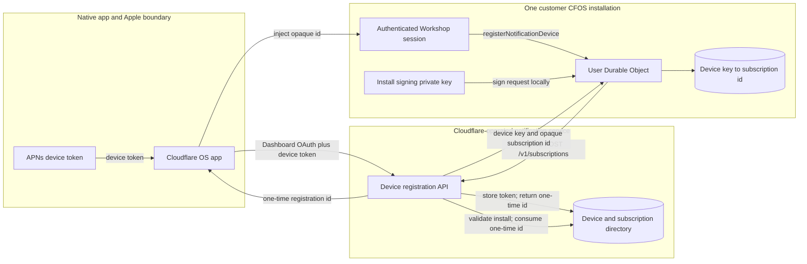
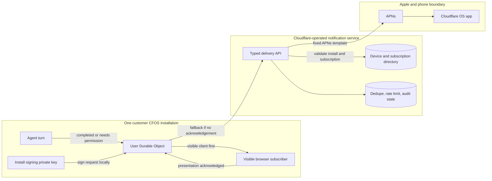

# Notifications architecture

Notifications are a platform feature, not a gatekeeper. The Workshop backend signs each request to
the Cloudflare-operated notification service with the installation's signing key. Each User
Durable Object stores one opaque subscription id per registered device, keyed by the
install-scoped device key the service returns with it, so a device that registers again replaces
its own subscription. The central service owns APNs delivery and the device/subscription
directory, and accepts only fixed, typed notification templates. It does not accept arbitrary
notification text or any provider OAuth credential.

## Registration

Data boundaries:

- The APNs device token and Dashboard OAuth bearer never enter the customer installation.
- The install signing private key is a backend secret, held like `CF_AI_GATEWAY_API_TOKEN`; gadget
  and agent code run in isolates whose env never includes it.
- Workshop core stores only opaque central subscription ids, which are bound to the installation
  and useless without the install signing key, and the install-scoped device key each one reaches.
- A one-time device registration id is short-lived and cannot send a notification.

The native app hands the SPA a one-time registration id by setting
`window.__CLOUDFLARE_OS_NOTIFICATION_DEVICE_REGISTRATION__` before load or dispatching a
`cloudflare-os:notification-device-registration` `CustomEvent` with
`detail.deviceRegistrationId`. If none was injected, the SPA calls
`window.__CLOUDFLARE_OS_REQUEST_NOTIFICATION_DEVICE_REGISTRATION__()`, when present, once each
time the signed-in app mounts (a WebSocket reconnect does not remount it) to request one.
The SPA reports the outcome to `webkit.messageHandlers.cloudflareOSNotificationReady` as
`{type: "ready"}` or `{type: "failed"}`.

## Delivery

Only the event id, event type, task id (`<workspaceId>:<chatId>`), bounded chat title, opaque
subscription id, and same-origin deep-link path cross the central boundary during a send, plus the
headers every signed request carries: install id, key id, timestamp, nonce, body digest, and
signature. Permission details, chat content, gatekeeper grants, and provider credentials do not. A
visible browser tab is offered the notification first, and push is sent to every registered device
only if no tab acknowledges it within three seconds. A tab subscribes while visible, and again if a
User DO reset drops its subscription. When the service answers `device_gone` or
`invalid_subscription`, the User DO drops that subscription; the device subscribes again when its
app next opens. Any other failure, including `invalid_signature`, keeps it. Only turns a person
started announce completion; callback turns, such as a schedule, and spawned agents notify only
when they need the user's permission. A turn that an approval or accepted connection resumes
belongs to whoever decided: it runs on their model and account, so its notifications go to them.
The deep link opens the chat with `showChat`, which leaves full-screen preview and switches a phone
showing the workspace's app to the chat.

## Deployment contract

The trusted deploy service injects these into the backend; the private key is a secret:

- `NOTIFICATION_SERVICE_URL` (an `https:` origin; requests to any other are refused)
- `CFOS_INSTALL_ID`
- `CFOS_INSTALL_KEY_ID`
- `CFOS_INSTALL_PRIVATE_KEY` (base64 PKCS#8 P-256)

Self-hosted deployments may omit them. Browser notifications continue to work; native device
registration fails and the SPA reports `{type: "failed"}` to the app.
